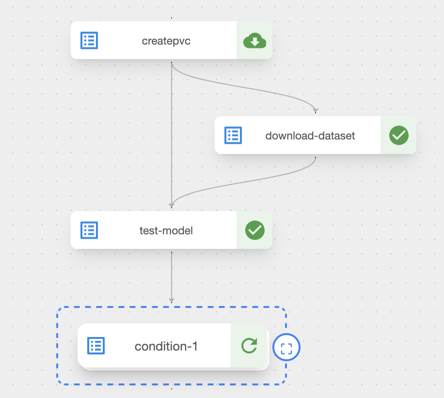
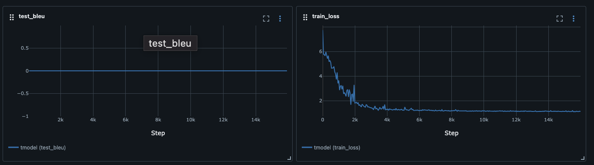
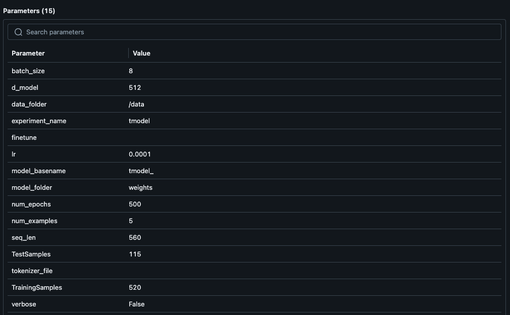

# Kubeflow Pipelines

## Usage

1. Upload notebook 
2. Define environment variables
3. Run cells defining training pipeline
3. Run/Schedule pipeline

## Pipeline Description

The pipeline is ran each day. In this process this is done:

- New data is downloaded
- The current best model is downloaded and evaluated
- If the model has degraded or is not proficient, training is ran

At the time of writing this I only have 500 samples in training set, so a test BLEU score of 0 is expected, though I hope in the coming days it will improve.

The pipeline records metrics in mlflow and records the hyperparameters/logs/outputs of each run.

